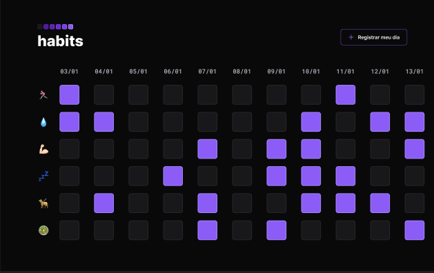

  

<h3 align="center">
Você no controle da sua rotina!
</h3>

  

<h4 align="center"> 
	🚧  NLW Setup - Finalizado 🚧
</h4>

---

 <a href="#-sobre-o-projeto">Sobre</a> •
 <a href="#-layout">Layout</a> • 
 <a href="#-tecnologias">Tecnologias</a> • 
 <a href="#user-content--licença">Licença</a>

## 💻 Sobre o projeto

Projeto sendo construído durante o **NLW - Next Level Week Setup** da [Rocketseat](https://lp.rocketseat.com.br/nlw) do dia 16 ao 20 de Janeiro de 2023, na trilha Explorer. 
Onde iremos desenvolver o Habits, que é um app para monitoramento de tarefas diárias para auxiliar os seus usuários a rastrear as suas atividades realizadas e não realizadas.
O NLW é uma experiência online com muito conteúdo prático, desafios e hacks onde o conteúdo fica disponível durante uma semana. 🚀

---

## 🎨 Layout

O layout da aplicação está disponível no Figma:

## 🖥 Preview 

  

  

---

## 🚀 Como executar o projeto - Pré-requisitos

Antes de começar, você vai precisar ter instalado em sua máquina as seguintes ferramentas:
[Git](https://git-scm.com), além disto é bom ter um editor para trabalhar com o código como [VSCode](https://code.visualstudio.com/)

## 🛠 Tecnologias

As seguintes ferramentas foram usadas na construção do projeto:

- [HTML](https://html.com/)
- [CSS](https://www.w3.org/Style/CSS/Overview.en.html)
- [Javascript](https://www.javascript.com/)

## 📝 Licença

Este projeto esta sobe a licença [MIT](./LICENSE).

Feito com ❤️ por Júlio Latorre 👋🏽 

---